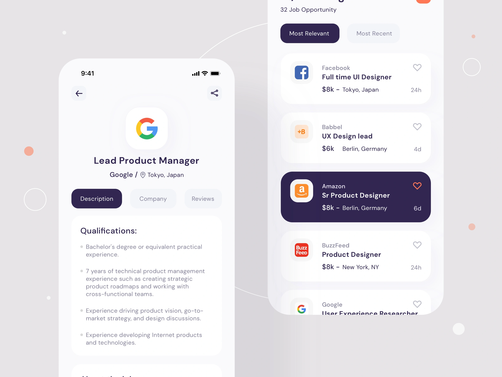

<div align="center">
    <a href="" target="_blank">
      
    </a>
  <h3 align="center">Job Seeker - Mobile App</h3>
</div>

##  <br /> 📋 <a name="table">Table of Contents</a>

- ✨ [Introduction](#introduction)
- ⚙️ [Tech Stack](#tech-stack)
- 📝 [Features](#features)
- 🚀 [Quick Start](#quick-start)

##  <br /> <a name="introduction">✨ Introduction</a>

**[EN]** A hands-on experience in React Native development, this project involves building a feature-rich job seeker app with a strong focus on UI/UX, external data integration, and best practices. The app leverages RapidAPI to efficiently help users find job opportunities.

**[FR]** Une expérience pratique du développement en React Native, ce projet consiste à créer une application de recherche d'emploi riche en fonctionnalités avec un fort accent sur l'UI/UX, l'intégration de données externes et les meilleures pratiques. L'application utilise RapidAPI pour aider efficacement les utilisateurs à trouver des opportunités d'emploi.


##  <br /> <a name="tech-stack">⚙️ Tech Stack</a>

- **React Native** is a popular framework for building mobile applications using JavaScript and React. It enables developers to create native apps for iOS and Android with a single codebase, leveraging native components for a seamless user experience. React Native's component-based architecture and hot-reloading feature enhance development efficiency and code maintainability.

- **Expo** is an open-source platform designed for React Native development, providing a set of tools and services that simplify the process of building, deploying, and testing mobile applications. It offers a managed workflow with pre-configured native modules, enabling developers to focus on writing JavaScript code without worrying about native code integration. Expo's rich ecosystem and development tools accelerate the development cycle and enhance app performance.

- **RapidAPI** is a powerful platform that allows developers to discover, connect, and manage thousands of APIs. It provides a unified access point for a vast array of APIs, enabling easy integration of external data and services into applications. RapidAPI simplifies the process of consuming APIs, making development faster and more efficient.

- **Axios** is a promise-based HTTP client for JavaScript, widely used for making asynchronous requests to APIs and handling responses. It simplifies the process of sending HTTP requests, managing request and response data, and handling errors. Axios supports various request methods, interceptors, and automatic JSON transformation, making it a versatile tool for interacting with APIs.

- **React** is a popular JavaScript library for building user interfaces, particularly single-page applications where data changes over time. React's component-based architecture allows developers to create reusable UI components, making development more efficient and the codebase easier to maintain. 

- **Node.js** is a versatile JavaScript runtime built on Chrome's V8 engine, enabling server-side scripting and the creation of scalable network applications. Its event-driven, non-blocking I/O model makes it lightweight and efficient, perfect for real-time applications that require high throughput. Node.js allows developers to use JavaScript for both client-side and server-side code, streamlining development and enhancing code reusability.


## <br/> <a name="features">📝 Features</a>

👉 **Modern UI/UX Design**: Develop an aesthetically pleasing user interface using React Native components.

👉 **Third Party API Integration**: Fetch data from an external API and seamlessly integrate it into the app.

👉 **Search & Pagination Functionality**: Implement search functionality and pagination for efficient data navigation.

👉 **Custom API Data Fetching Hooks**: Create custom hooks for streamlined and reusable API data fetching.

👉 **Dynamic Home Page**: Explore diverse jobs from popular and nearby locations across different categories.

👉 **Browse with Ease on Explore Page**: Page: Navigate through various jobs spanning different categories and types.

👉 **Detailed Job Insights**: View comprehensive details, application links, salary info, responsibilities, and qualifications.

👉 **Tailored Job Search**: Find jobs based on a particular title.

👉 **Robust Loading and Error Management**: Ensure effective handling of loading processes and error scenarios. 

👉 **Optimized for All Devices**: A responsive design for a seamless user experience across various devices.


## <br /> <a name="quick-start">🚀 Quick Start</a>

Follow these steps to set up the project locally on your machine.

<br/>**Prerequisites**

Make sure you have the following installed on your machine:

- [Git](https://git-scm.com/)
- [Node.js](https://nodejs.org/en)
- [npm](https://www.npmjs.com/) (Node Package Manager)

<br/>**Cloning the Repository**

```bash
git clone {git remote URL}
```

<br/>**Installation**

Let's install the project dependencies, from your terminal, run:

```bash
npm install
# or
yarn install
```

<br/>**Set Up Environment Variables**

Create a new file named `.env` in the root of your project and add the following content:

```env
RAPID_API_KEY=
```

Replace the placeholder values with your actual respective account credentials:

- [Rapid API](https://rapidapi.com/hub)


<br/>**Running the Project**

Installation will take a minute or two, but once that's done, you should be able to run the following command:

```bash
npm start
# or
npx expo start -c
```

Download the [Expo Go](https://expo.dev/go) app onto your device, then use it to scan the QR code from Terminal and run.

Alternatively, you can also use [BlueStacks 5](https://www.bluestacks.com/bluestacks-5.html) to emulate an Android device on your computer.